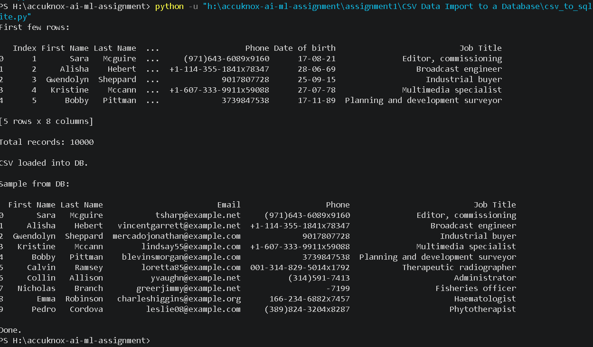
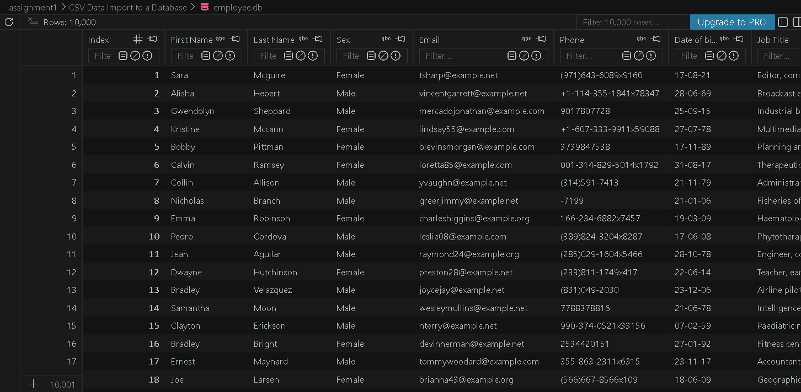

# Question 3: CSV Data Import to SQLite Database

## Objective

Read employees information from a CSV file and importing the data into SQLite database using Python.

## Dataset Used

**File:** `Employee 1000x.csv`

The dataset contains employee information such as:

* Index
* First Name
* Last Name
* Sex
* Email
* Phone
* Date of Birth
* Job Title

**Total Records:** 10,000

## Technologies Used

* Python
* Pandas
* SQLite3

## Approach

1. Read the CSV file using Pandas.
2. Create a SQLite database (`employee.db`).
3. Create an `employees` table.
4. Import all the records from the CSV file into the database.
5. Verify the imported records using SQLite Viewer.

## Install Dependency

```bash
pip install pandas
```

## How to Run

```bash
python csv_to_sqlite.py
```

## Database Table

### Table Name: employees

| Column        |
| ------------- |
| Index         |
| First Name    |
| Last Name     |
| Sex           |
| Email         |
| Phone         |
| Date of Birth |
| Job Title     |

## Sample Output

```text
Dataset loaded successfully

Total Records: 10000

CSV data imported successfully!

Data saved to employee.db
```

## Verification

The imported data was verified using SQLite Viewer.

Example query:

```sql
SELECT COUNT(*) FROM employees;
```

Result:

```text
10000
```

This confirms that all employee records were imported successfully.

## Screenshots

### Terminal Output



### SQLite Database




## Conclusion

This project demonstrates how CSV data can be imported into a SQLite database using Python and Pandas.I used employee dataset containing 10,000 records was successfully loaded, stored, and verified in the database.
