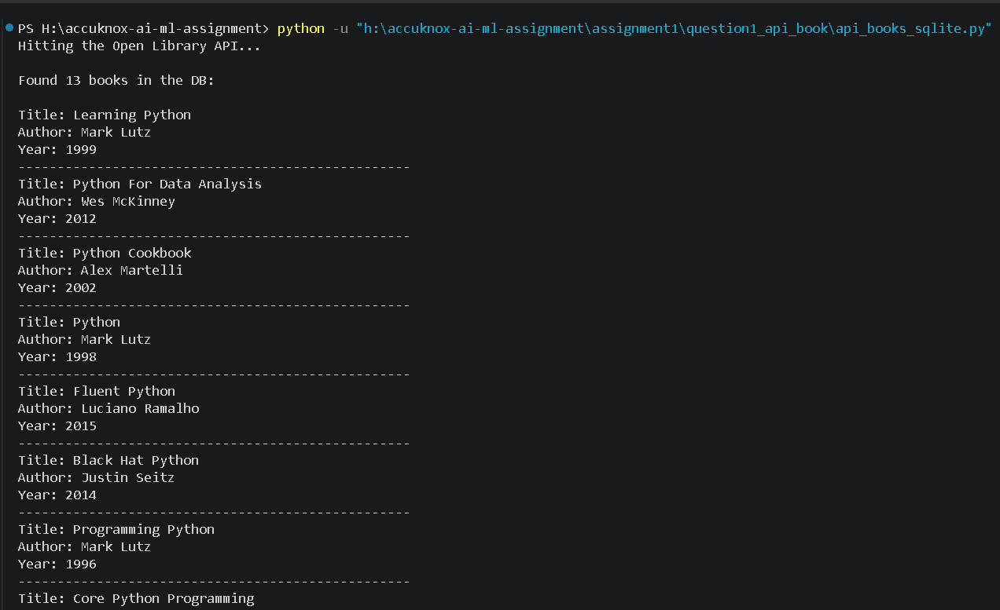
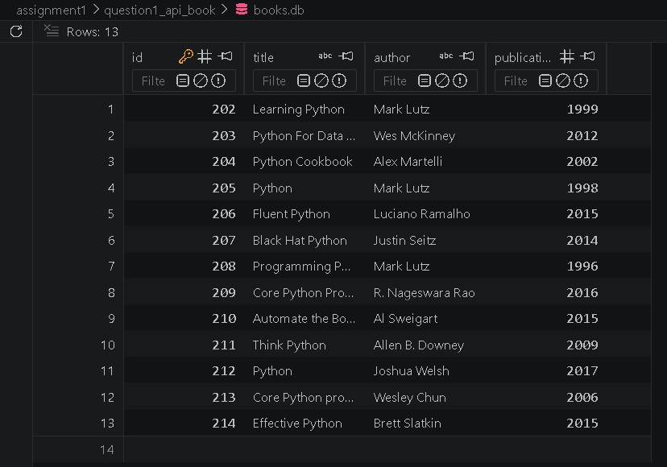

# Question 1: API Data Retrieval and SQLite Storage

## Objective

Fetch book data from an external REST API, store it in a local SQLite database, and display the retrieved data.

## Technologies Used

Python
Requests
SQLite3
Open Library API

## API Used

https://openlibrary.org/search.json?q=python

## Features

* It fetches books data from open library API.
* Then it will extracts the book title, author, and publication year.
* It stores the data in a SQLite database (`books.db`).
* Displays stored records in the terminal.
* it will creates the database automatically if it does not exist.


## How to Run

1. Install dependencies:

```bash
pip install requests
```

2. Run the script:

```bash
python api_books_sqlite.py
```

## Database Schema

Table: books

| Column           | Type    |
| ---------------- | ------- |
| id               | INTEGER |
| title            | TEXT    |
| author           | TEXT    |
| publication_year | INTEGER |

## Sample Output

* Learning Python - Mark Lutz (1999)
* Python Cookbook - Alex Martelli (2002)
* Fluent Python - Luciano Ramalho (2015)

## Screenshots

### Terminal Output



### SQLite Database



## Assumptions

* Open Library API is available and accessible.
* I used only 13 book records for demonstration purposes.
* Missing values are replaced with default values such as "Unknown".
